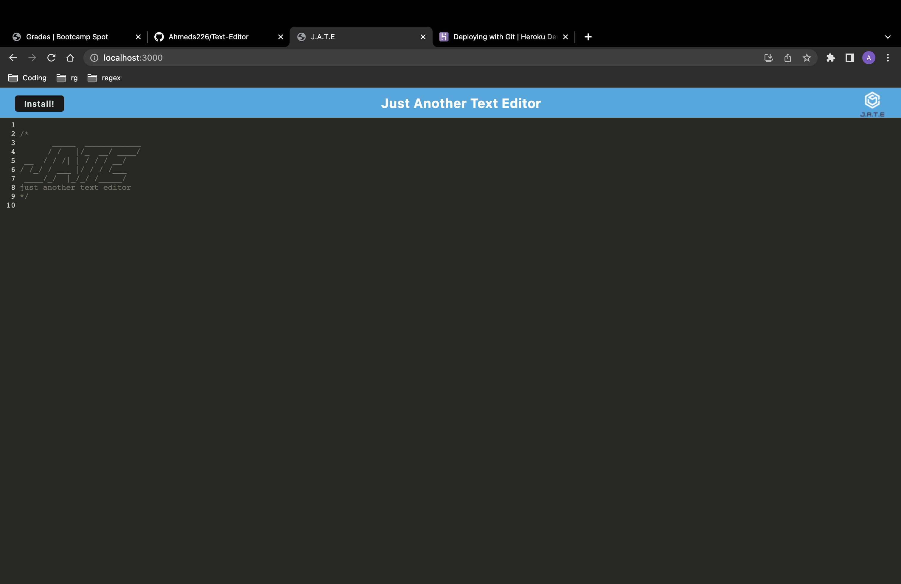

# Text-Editor

I have created a text editor that runs in the browser. I have also used numerous data persistence techniques in case some of them are redundant and are not supported by any browser. Additionally, the application is also usable offline. Furthermore, I have utilised the indexedDB database to not only store the data but also retreive the data.

## Preview:

## Deployed Link:
